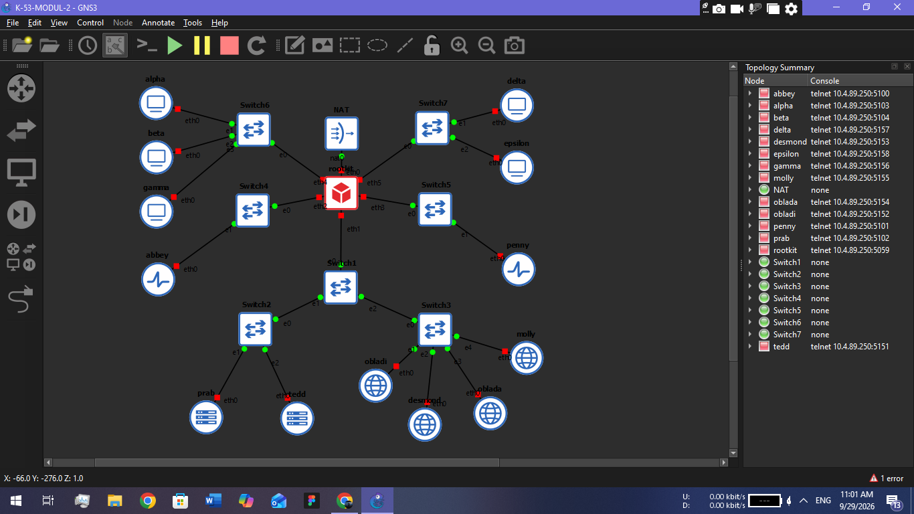

# Jarkom-Modul-2-2026-K-53
Data Communication and Computer Networks Practicum

Soal 1 :

1. Router (rootkit)
Buka konsol rootkit, lalu ketik perintah berikut:
```bash
ip addr add 10.90.2.1/24 dev eth1
ip addr add 10.90.4.1/24 dev eth2
ip addr add 10.90.3.1/24 dev eth3
ip addr add 10.90.1.1/24 dev eth4
ip addr add 10.90.5.1/24 dev eth5
ip link set eth1 up
ip link set eth2 up
ip link set eth3 up
ip link set eth4 up
ip link set eth5 up
sysctl -w net.ipv4.ip_forward=1
```
2. Sayap Kiri (alpha, beta, gamma) - Subnet 10.90.1.x (Gateway: 10.90.1.1)
alpha:
```bash
ip addr flush dev eth0
ip addr add 10.90.1.2/24 dev eth0
ip link set eth0 up
ip route add default via 10.90.1.1
```
beta:
```Bash
ip addr flush dev eth0
ip addr add 10.90.1.3/24 dev eth0
ip link set eth0 up
ip route add default via 10.90.1.1
```
gamma:
```Bash
ip addr flush dev eth0
ip addr add 10.90.1.4/24 dev eth0
ip link set eth0 up
ip route add default via 10.90.1.1
```
3. Sayap Kanan (delta, epsilon) - Subnet 10.90.5.x (Gateway: 10.90.5.1)
delta:
```Bash
ip addr flush dev eth0
ip addr add 10.90.5.2/24 dev eth0
ip link set eth0 up
ip route add default via 10.90.5.1
```
epsilon:
```Bash
ip addr flush dev eth0
ip addr add 10.90.5.3/24 dev eth0
ip link set eth0 up
ip route add default via 10.90.5.1
```
4. Gerbang Penyaring (abbey, penny)
abbey (Subnet 10.90.4.x | Gateway: 10.90.4.1):
```Bash
ip addr flush dev eth0
ip addr add 10.90.4.2/24 dev eth0
ip link set eth0 up
ip route add default via 10.90.4.1
```
penny (Subnet 10.90.3.x | Gateway: 10.90.3.1):
```Bash
ip addr flush dev eth0
ip addr add 10.90.3.2/24 dev eth0
ip link set eth0 up
ip route add default via 10.90.3.1
```
5. Area Bawah (prab, tedd, obladi, desmond, oblada, molly) - Subnet 10.90.2.x (Gateway: 10.90.2.1)
prab:
```Bash
ip addr flush dev eth0
ip addr add 10.90.2.2/24 dev eth0
ip link set eth0 up
ip route add default via 10.90.2.1
```
tedd:
```Bash
ip addr flush dev eth0
ip addr add 10.90.2.3/24 dev eth0
ip link set eth0 up
ip route add default via 10.90.2.1
```
obladi:
```Bash
ip addr flush dev eth0
ip addr add 10.90.2.4/24 dev eth0
ip link set eth0 up
ip route add default via 10.90.2.1
```
desmond:
```Bash
ip addr flush dev eth0
ip addr add 10.90.2.5/24 dev eth0
ip link set eth0 up
ip route add default via 10.90.2.1
```
oblada:
```Bash
ip addr flush dev eth0
ip addr add 10.90.2.6/24 dev eth0
ip link set eth0 up
ip route add default via 10.90.2.1
```
molly:
```Bash
ip addr flush dev eth0
ip addr add 10.90.2.7/24 dev eth0
ip link set eth0 up
ip route add default via 10.90.2.1
```
