## Jarkom-Modul-2-2026-K-53


### Soal 1 : Konfigurasi IP Address dan Default Gateway


Pemetaan interface rootkit terhadap switch:

| Interface | Terhubung ke | Node                                       | Subnet           |
|-----------|--------------|--------------------------------------------|------------------|
| eth0      | NAT          | -                                          | 192.168.122.0/24 |
| eth1      | Switch1      | prab, tedd, obladi, desmond, oblada, molly | 10.90.2.0/24     |
| eth2      | Switch4      | abbey                                      | 10.90.4.0/24     |
| eth3      | Switch5      | penny                                      | 10.90.3.0/24     |
| eth4      | Switch6      | alpha, beta, gamma                         | 10.90.1.0/24     |
| eth5      | Switch7      | delta, epsilon                             | 10.90.5.0/24     |

#### 1. Router (rootkit)

Buka konsol rootkit, lalu jalankan:
```bash
cat > /root/rootkit-ip.sh << 'EOF'
# Bersihkan IP lama supaya script aman dijalankan berulang
for i in 1 2 3 4 5; do ip addr flush dev eth$i; done

# Pasang IP untuk semua subnet internal
ip addr add 10.90.2.1/24 dev eth1
ip addr add 10.90.4.1/24 dev eth2
ip addr add 10.90.3.1/24 dev eth3
ip addr add 10.90.1.1/24 dev eth4
ip addr add 10.90.5.1/24 dev eth5

# Aktifkan interface
for i in 1 2 3 4 5; do ip link set eth$i up; done

# Aktifkan IP forwarding
sysctl -w net.ipv4.ip_forward=1
EOF

bash /root/rootkit-ip.sh
```
Verifikasi (setiap interface harus punya subnet yang berbeda):
```bash
ip -br addr
ip route
```

#### 2. Sayap Kiri (alpha, beta, gamma) - Subnet 10.90.1.x (Gateway: 10.90.1.1)

alpha:
```bash
cat > /root/alpha.sh << 'EOF'
ip addr flush dev eth0
ip addr add 10.90.1.2/24 dev eth0
ip link set eth0 up
ip route replace default via 10.90.1.1
EOF

bash /root/alpha.sh
```
beta:
```bash
cat > /root/beta.sh << 'EOF'
ip addr flush dev eth0
ip addr add 10.90.1.3/24 dev eth0
ip link set eth0 up
ip route replace default via 10.90.1.1
EOF

bash /root/beta.sh
```
gamma:
```bash
cat > /root/gamma.sh << 'EOF'
ip addr flush dev eth0
ip addr add 10.90.1.4/24 dev eth0
ip link set eth0 up
ip route replace default via 10.90.1.1
EOF

bash /root/gamma.sh
```

#### 3. Sayap Kanan (delta, epsilon) - Subnet 10.90.5.x (Gateway: 10.90.5.1)

delta:
```bash
cat > /root/delta.sh << 'EOF'
ip addr flush dev eth0
ip addr add 10.90.5.2/24 dev eth0
ip link set eth0 up
ip route replace default via 10.90.5.1
EOF

bash /root/delta.sh
```
epsilon:
```bash
cat > /root/epsilon.sh << 'EOF'
ip addr flush dev eth0
ip addr add 10.90.5.3/24 dev eth0
ip link set eth0 up
ip route replace default via 10.90.5.1
EOF

bash /root/epsilon.sh
```

#### 4. Gerbang Penyaring (abbey, penny)

abbey (Subnet 10.90.4.x | Gateway: 10.90.4.1):
```bash
cat > /root/abbey.sh << 'EOF'
ip addr flush dev eth0
ip addr add 10.90.4.2/24 dev eth0
ip link set eth0 up
ip route replace default via 10.90.4.1
EOF

bash /root/abbey.sh
```
penny (Subnet 10.90.3.x | Gateway: 10.90.3.1):
```bash
cat > /root/penny.sh << 'EOF'
ip addr flush dev eth0
ip addr add 10.90.3.2/24 dev eth0
ip link set eth0 up
ip route replace default via 10.90.3.1
EOF

bash /root/penny.sh
```

#### 5. Area Bawah (prab, tedd, obladi, desmond, oblada, molly) - Subnet 10.90.2.x (Gateway: 10.90.2.1)

prab:
```bash
cat > /root/prab.sh << 'EOF'
ip addr flush dev eth0
ip addr add 10.90.2.2/24 dev eth0
ip link set eth0 up
ip route replace default via 10.90.2.1
EOF

bash /root/prab.sh
```
tedd:
```bash
cat > /root/tedd.sh << 'EOF'
ip addr flush dev eth0
ip addr add 10.90.2.3/24 dev eth0
ip link set eth0 up
ip route replace default via 10.90.2.1
EOF

bash /root/tedd.sh
```
obladi:
```bash
cat > /root/obladi.sh << 'EOF'
ip addr flush dev eth0
ip addr add 10.90.2.4/24 dev eth0
ip link set eth0 up
ip route replace default via 10.90.2.1
EOF

bash /root/obladi.sh
```
desmond:
```bash
cat > /root/desmond.sh << 'EOF'
ip addr flush dev eth0
ip addr add 10.90.2.5/24 dev eth0
ip link set eth0 up
ip route replace default via 10.90.2.1
EOF

bash /root/desmond.sh
```
oblada:
```bash
cat > /root/oblada.sh << 'EOF'
ip addr flush dev eth0
ip addr add 10.90.2.6/24 dev eth0
ip link set eth0 up
ip route replace default via 10.90.2.1
EOF

bash /root/oblada.sh
```
molly:
```bash
cat > /root/molly.sh << 'EOF'
ip addr flush dev eth0
ip addr add 10.90.2.7/24 dev eth0
ip link set eth0 up
ip route replace default via 10.90.2.1
EOF

bash /root/molly.sh
```

#### Verifikasi Soal 1

Dari masing-masing node, ping gateway-nya. Contoh dari alpha:
```bash
ping -c 3 10.90.1.1
```

---

### Soal 2 : Konfigurasi NAT & Akses Internet

Buka konsol rootkit, aktifkan interface WAN (`eth0`) ke jaringan NAT GNS3, lalu konfigurasikan masquerade agar semua host internal bisa menjangkau internet publik menggunakan IP address. Policy `FORWARD` bawaan sudah `ACCEPT`, jadi aturan `FORWARD` per interface tidak diperlukan.

```bash
cat > /root/rootkit-nat.sh << 'EOF'
# Interface WAN (jaringan NAT GNS3)
ip addr flush dev eth0
ip addr add 192.168.122.100/24 dev eth0
ip link set eth0 up
ip route replace default via 192.168.122.1

# NAT / Masquerade untuk semua subnet internal
iptables -t nat -F POSTROUTING
iptables -t nat -A POSTROUTING -o eth0 -j MASQUERADE
EOF

bash /root/rootkit-nat.sh
```
Verifikasi di rootkit:
```bash
ip -br addr
ip route
iptables -t nat -L POSTROUTING -n -v
iptables -L FORWARD -n | head -1     # harus: policy ACCEPT
sysctl net.ipv4.ip_forward           # harus: = 1
ping -c 3 192.168.122.1
ping -c 3 8.8.8.8
```
Verifikasi dari klien (misalnya alpha), menggunakan IP address:
```bash
ping -c 3 8.8.8.8
```

> Jika rootkit di-restart, jalankan ulang keduanya: `bash /root/rootkit-ip.sh` lalu `bash /root/rootkit-nat.sh`.

---

### Soal 3 : Routing Internal & Resolver Awal

Pastikan seluruh node bisa saling terhubung lewat rootkit, lalu tambahkan resolver sementara `192.168.122.1` pada `/etc/resolv.conf` di setiap node non-router (alpha, beta, gamma, delta, epsilon, prab, tedd, abbey, penny, obladi, desmond, oblada, molly) agar paket instalasi bisa diunduh dari internet sejak awal.

Jalankan di setiap node non-router:
```bash
cat > /root/resolver-awal.sh << 'EOF'
echo "nameserver 192.168.122.1" > /etc/resolv.conf
EOF

bash /root/resolver-awal.sh
```

Uji routing internal antar subnet, contoh dari alpha:
```bash
ping -c 3 10.90.1.1     # gateway
ping -c 3 10.90.5.2     # delta (sayap kanan)
ping -c 3 10.90.4.2     # abbey
ping -c 3 10.90.3.2     # penny
ping -c 3 10.90.2.2     # prab
```

Uji akses internet menggunakan nama domain:
```bash
ping -c 3 google.com
```


> Urutan resolver ini akan diganti di Soal 4 menjadi prab → tedd → 192.168.122.1 setelah DNS internal hidup.


### Soal 4 : Konfigurasi DNS Server Master-Slave

#### Langkah 1 : Instalasi BIND9 di prab dan tedd

Buka konsol node prab dan tedd, lalu instal paket bind9 (resolver awal sudah `192.168.122.1` dari Soal 3):
```bash
echo "nameserver 192.168.122.1" > /etc/resolv.conf
apt-get update
apt-get install bind9 dnsutils -y
```

#### Langkah 2 : Konfigurasi Master DNS pada prab (ns1)

Edit `/etc/bind/named.conf.options`, dengan forwarders mengarah ke `192.168.122.1`:
```bash
cat > /etc/bind/named.conf.options << 'EOF'
options {
    directory "/var/cache/bind";
    forwarders {
        192.168.122.1;
    };
    dnssec-validation no;
    listen-on { any; };
    allow-query { any; };
};
EOF
```

Daftarkan zona `k53.com` sebagai master di `/etc/bind/named.conf.local`, lengkap dengan `allow-transfer` dan `notify` ke tedd (10.90.2.3):
```bash
cat > /etc/bind/named.conf.local << 'EOF'
zone "k53.com" {
    type master;
    file "/etc/bind/k53/k53.com";
    allow-transfer { 10.90.2.3; };
    notify yes;
};
EOF
```

Buat direktori dan file zona `/etc/bind/k53/k53.com` (SOA, NS, A record prab dan tedd, serta A record apex `k53.com` yang mengarah ke penny, yaitu 10.90.3.2):
```bash
mkdir -p /etc/bind/k53
cat > /etc/bind/k53/k53.com << 'EOF'
$TTL 604800
@   IN  SOA prab.k53.com. root.k53.com. (
        2026092901 ; Serial
        604800     ; Refresh
        86400      ; Retry
        2419200    ; Expire
        604800 )   ; Negative Cache TTL

@       IN  NS  prab.k53.com.
@       IN  NS  tedd.k53.com.

prab    IN  A   10.90.2.2
tedd    IN  A   10.90.2.3
@       IN  A   10.90.3.2
EOF
```

Cek sintaks config dan zona sebelum menjalankan named:
```bash
named-checkconf
named-checkzone k53.com /etc/bind/k53/k53.com
```

Jalankan named (matikan dulu proses lama supaya config baru terbaca dan tidak jalan dobel):
```bash
pkill named
sleep 1
named
```

Cek apakah named sudah jalan (harus hanya satu proses):
```bash
ps aux | grep named
```

#### Langkah 3 : Konfigurasi Slave DNS pada tedd (ns2)

Samakan `/etc/bind/named.conf.options` dengan prab:
```bash
cat > /etc/bind/named.conf.options << 'EOF'
options {
    directory "/var/cache/bind";
    forwarders {
        192.168.122.1;
    };
    dnssec-validation no;
    listen-on { any; };
    allow-query { any; };
};
EOF
```

Daftarkan zona `k53.com` sebagai slave yang mengambil data dari master prab (10.90.2.2) di `/etc/bind/named.conf.local`:
```bash
cat > /etc/bind/named.conf.local << 'EOF'
zone "k53.com" {
    type slave;
    file "/var/cache/bind/k53.com";
    masters { 10.90.2.2; };
};
EOF
```

Cek config, lalu jalankan named:
```bash
named-checkconf
pkill named
sleep 1
named
```

Pastikan zona berhasil di-transfer dari prab:
```bash
ls -l /var/cache/bind/k53.com
```

#### Langkah 4 : Pembaruan Resolver pada Seluruh Node Non-Router

Setelah DNS internal hidup, perbarui urutan resolver pada seluruh node non-router (alpha, beta, gamma, delta, epsilon, prab, tedd, abbey, penny, obladi, desmond, oblada, molly) menjadi: prab (10.90.2.2), tedd (10.90.2.3), lalu 192.168.122.1.

Jalankan di setiap node:
```bash
echo -e "nameserver 10.90.2.2\nnameserver 10.90.2.3\nnameserver 192.168.122.1" > /etc/resolv.conf
```

#### Langkah 5 : Verifikasi

Uji dari klien (misalnya alpha) bahwa apex maupun hostname dijawab dengan benar:
```bash
dig k53.com
dig prab.k53.com
dig tedd.k53.com
```
Ketiganya harus mengembalikan `NOERROR` dengan flag `aa`, dengan jawaban `10.90.3.2`, `10.90.2.2`, dan `10.90.2.3`.

Pastikan tedd juga menjawab secara authoritative dan serial SOA di kedua server sama:
```bash
dig @10.90.2.2 k53.com SOA +short
dig @10.90.2.3 k53.com SOA +short
```

Pastikan akses internet lewat forwarders tetap berfungsi:
```bash
ping -c 2 google.com
```
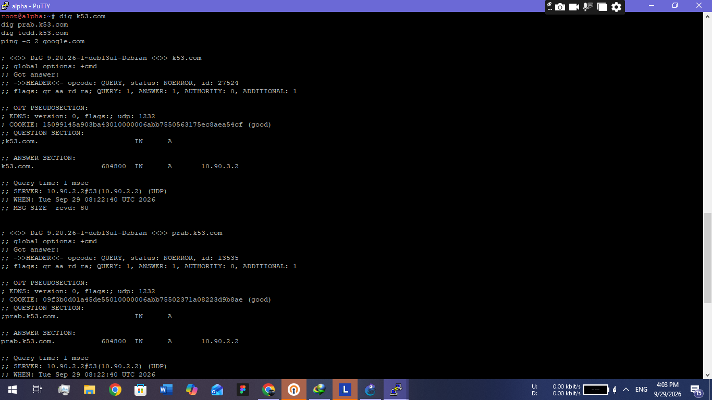
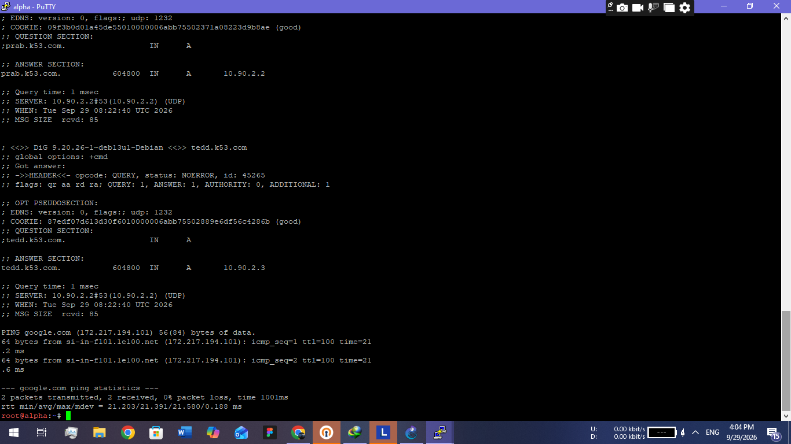

### Soal 5 : Hostname dan Domain Setiap Entitas

Setiap node diberi hostname sesuai glosarium, lalu dibuatkan domain `<nama>.k53.com` di zona DNS prab. Node prab dan tedd dikecualikan dari pembuatan A record baru karena record mereka sudah dibuat di Soal 4, tetapi hostname keduanya tetap diatur.

| Node    | IP         | Domain            |
|---------|------------|-------------------|
| rootkit | 10.90.2.1  | rootkit.k53.com   |
| alpha   | 10.90.1.2  | alpha.k53.com     |
| beta    | 10.90.1.3  | beta.k53.com      |
| gamma   | 10.90.1.4  | gamma.k53.com     |
| delta   | 10.90.5.2  | delta.k53.com     |
| epsilon | 10.90.5.3  | epsilon.k53.com   |
| abbey   | 10.90.4.2  | abbey.k53.com     |
| penny   | 10.90.3.2  | penny.k53.com     |
| obladi  | 10.90.2.4  | obladi.k53.com    |
| desmond | 10.90.2.5  | desmond.k53.com   |
| oblada  | 10.90.2.6  | oblada.k53.com    |
| molly   | 10.90.2.7  | molly.k53.com     |
| prab    | 10.90.2.2  | prab.k53.com (sudah ada, Soal 4)  |
| tedd    | 10.90.2.3  | tedd.k53.com (sudah ada, Soal 4)  |

> Rootkit memiliki lima IP (satu per subnet). Untuk record DNS dipakai `10.90.2.1`, yaitu sisi yang satu subnet dengan DNS server.

#### Langkah 1 : Tambahkan A record di prab (ns1)

Buka konsol prab. Tulis ulang zona dengan serial dinaikkan menjadi `2026092902` supaya tedd ikut tersinkron:
```bash
cat > /etc/bind/k53/k53.com << 'EOF'
$TTL 604800
@   IN  SOA prab.k53.com. root.k53.com. (
        2026092902 ; Serial
        604800     ; Refresh
        86400      ; Retry
        2419200    ; Expire
        604800 )   ; Negative Cache TTL

@       IN  NS  prab.k53.com.
@       IN  NS  tedd.k53.com.

; Soal 4
prab    IN  A   10.90.2.2
tedd    IN  A   10.90.2.3
@       IN  A   10.90.3.2

; Soal 5
rootkit IN  A   10.90.2.1
alpha   IN  A   10.90.1.2
beta    IN  A   10.90.1.3
gamma   IN  A   10.90.1.4
delta   IN  A   10.90.5.2
epsilon IN  A   10.90.5.3
abbey   IN  A   10.90.4.2
penny   IN  A   10.90.3.2
obladi  IN  A   10.90.2.4
desmond IN  A   10.90.2.5
oblada  IN  A   10.90.2.6
molly   IN  A   10.90.2.7
EOF
```
Cek sintaks zona, lalu reload:
```bash
named-checkzone k53.com /etc/bind/k53/k53.com
rndc reload
```
Kalau `rndc` error, jalankan ulang named:
```bash
pkill named
sleep 1
named
```

#### Langkah 2 : Pastikan tedd menerima zona terbaru

Di tedd, tunggu beberapa detik lalu cek serial:
```bash
dig @10.90.2.2 k53.com SOA +short
dig @10.90.2.3 k53.com SOA +short
```
Serial di keduanya harus sama (`2026092902`). Kalau tedd belum ikut, paksa transfer:
```bash
rndc retransfer k53.com
```

#### Langkah 3 : Set hostname di setiap node

Jalankan di masing-masing node sesuai namanya. Script menulis `/etc/hostname` dan `/etc/hosts` agar hostname dikenali secara system-wide.

rootkit:
```bash
cat > /root/hostname.sh << 'EOF'
hostname rootkit
echo rootkit > /etc/hostname
cat > /etc/hosts << EOT
127.0.0.1 localhost
::1 localhost
10.90.2.1 rootkit.k53.com rootkit
EOT
EOF

bash /root/hostname.sh
```
alpha:
```bash
cat > /root/hostname.sh << 'EOF'
hostname alpha
echo alpha > /etc/hostname
cat > /etc/hosts << EOT
127.0.0.1 localhost
::1 localhost
10.90.1.2 alpha.k53.com alpha
EOT
EOF

bash /root/hostname.sh
```
beta:
```bash
cat > /root/hostname.sh << 'EOF'
hostname beta
echo beta > /etc/hostname
cat > /etc/hosts << EOT
127.0.0.1 localhost
::1 localhost
10.90.1.3 beta.k53.com beta
EOT
EOF

bash /root/hostname.sh
```
gamma:
```bash
cat > /root/hostname.sh << 'EOF'
hostname gamma
echo gamma > /etc/hostname
cat > /etc/hosts << EOT
127.0.0.1 localhost
::1 localhost
10.90.1.4 gamma.k53.com gamma
EOT
EOF

bash /root/hostname.sh
```
delta:
```bash
cat > /root/hostname.sh << 'EOF'
hostname delta
echo delta > /etc/hostname
cat > /etc/hosts << EOT
127.0.0.1 localhost
::1 localhost
10.90.5.2 delta.k53.com delta
EOT
EOF

bash /root/hostname.sh
```
epsilon:
```bash
cat > /root/hostname.sh << 'EOF'
hostname epsilon
echo epsilon > /etc/hostname
cat > /etc/hosts << EOT
127.0.0.1 localhost
::1 localhost
10.90.5.3 epsilon.k53.com epsilon
EOT
EOF

bash /root/hostname.sh
```
prab:
```bash
cat > /root/hostname.sh << 'EOF'
hostname prab
echo prab > /etc/hostname
cat > /etc/hosts << EOT
127.0.0.1 localhost
::1 localhost
10.90.2.2 prab.k53.com prab
EOT
EOF

bash /root/hostname.sh
```
tedd:
```bash
cat > /root/hostname.sh << 'EOF'
hostname tedd
echo tedd > /etc/hostname
cat > /etc/hosts << EOT
127.0.0.1 localhost
::1 localhost
10.90.2.3 tedd.k53.com tedd
EOT
EOF

bash /root/hostname.sh
```
abbey:
```bash
cat > /root/hostname.sh << 'EOF'
hostname abbey
echo abbey > /etc/hostname
cat > /etc/hosts << EOT
127.0.0.1 localhost
::1 localhost
10.90.4.2 abbey.k53.com abbey
EOT
EOF

bash /root/hostname.sh
```
penny:
```bash
cat > /root/hostname.sh << 'EOF'
hostname penny
echo penny > /etc/hostname
cat > /etc/hosts << EOT
127.0.0.1 localhost
::1 localhost
10.90.3.2 penny.k53.com penny
EOT
EOF

bash /root/hostname.sh
```
obladi:
```bash
cat > /root/hostname.sh << 'EOF'
hostname obladi
echo obladi > /etc/hostname
cat > /etc/hosts << EOT
127.0.0.1 localhost
::1 localhost
10.90.2.4 obladi.k53.com obladi
EOT
EOF

bash /root/hostname.sh
```
desmond:
```bash
cat > /root/hostname.sh << 'EOF'
hostname desmond
echo desmond > /etc/hostname
cat > /etc/hosts << EOT
127.0.0.1 localhost
::1 localhost
10.90.2.5 desmond.k53.com desmond
EOT
EOF

bash /root/hostname.sh
```
oblada:
```bash
cat > /root/hostname.sh << 'EOF'
hostname oblada
echo oblada > /etc/hostname
cat > /etc/hosts << EOT
127.0.0.1 localhost
::1 localhost
10.90.2.6 oblada.k53.com oblada
EOT
EOF

bash /root/hostname.sh
```
molly:
```bash
cat > /root/hostname.sh << 'EOF'
hostname molly
echo molly > /etc/hostname
cat > /etc/hosts << EOT
127.0.0.1 localhost
::1 localhost
10.90.2.7 molly.k53.com molly
EOT
EOF

bash /root/hostname.sh
```

#### Langkah 4 : Verifikasi hostname (di setiap node)

Contoh di alpha:
```bash
hostname                # alpha
hostname -f             # alpha.k53.com
cat /etc/hostname       # alpha
getent hosts alpha      # 10.90.1.2  alpha.k53.com alpha
```
Kalau prompt masih menampilkan nama lama, buka shell baru dengan mengetik `bash`.

#### Langkah 5 : Verifikasi DNS dari dua klien berbeda

Jalankan di alpha, lalu ulangi di delta:
```bash
for h in rootkit alpha beta gamma delta epsilon abbey penny obladi desmond oblada molly; do
  echo -n "$h.k53.com -> "
  dig +short $h.k53.com
done
```
Setiap hostname harus mengembalikan IP sesuai tabel di atas.
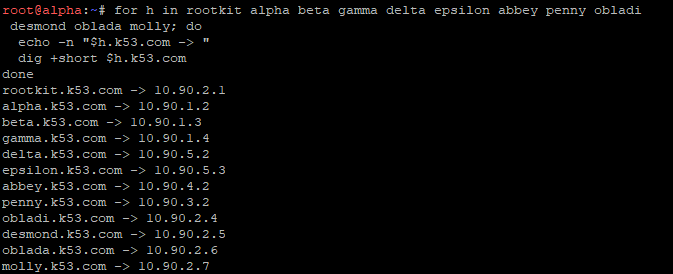
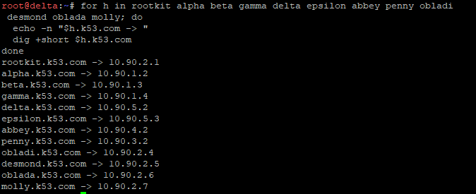

Pastikan tedd juga menjawab secara authoritative (harus ada flag `aa`):
```bash
dig @10.90.2.3 alpha.k53.com | grep flags
```
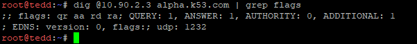
> Kalau node di-restart, jalankan ulang script IP-nya (Soal 1) lalu `bash /root/hostname.sh`.

### Soal 6 : Verifikasi Zone Transfer dan Serial SOA

Zone transfer dari prab (master) ke tedd (slave) sudah dikonfigurasi di Soal 4 lewat `allow-transfer` dan `notify yes` di prab, serta `masters { 10.90.2.2; }` di tedd. Di soal ini kita membuktikan bahwa tedd sudah menerima salinan zona terbaru dan serial SOA di keduanya sama.

#### Langkah 1 : Bandingkan serial SOA di prab dan tedd

Jalankan dari node mana saja (misalnya prab):
```bash
dig @10.90.2.2 k53.com SOA +short
dig @10.90.2.3 k53.com SOA +short
```
Angka serial (field ketiga) di kedua output harus sama, yaitu `2026092902`.

Bisa juga dilihat langsung di masing-masing server:
```bash
# di prab
rndc zonestatus k53.com | grep -E "type|serial"

# di tedd
rndc zonestatus k53.com | grep -E "type|serial"
```
Prab harus `type: primary` dan tedd `type: secondary`, dengan serial yang sama.

#### Langkah 2 : Pastikan tedd punya file salinan zona

Di tedd:
```bash
ls -l /var/cache/bind/k53.com
```
File harus ada dengan ukuran lebih dari 0. Di BIND versi baru, file slave disimpan dalam format raw sehingga tidak terbaca dengan `cat`. Untuk melihat isinya:
```bash
named-compilezone -f raw -F text -o - k53.com /var/cache/bind/k53.com
```

#### Langkah 3 : Uji zone transfer (AXFR) dari tedd ke prab

Di tedd:
```bash
dig @10.90.2.2 k53.com AXFR
```
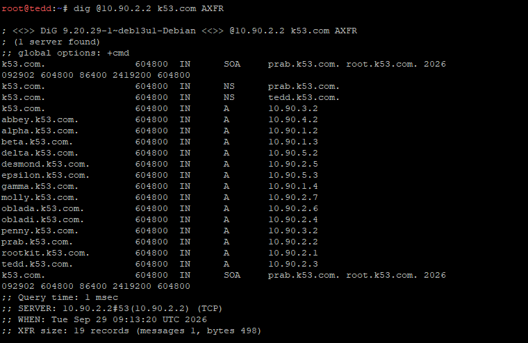
Outputnya harus menampilkan seluruh record zona, diawali dan diakhiri record SOA, tanpa `Transfer failed`. Ini juga membuktikan `allow-transfer` di prab mengizinkan IP tedd (10.90.2.3).

Kalau dicoba dari node lain (misalnya alpha), transfer harus ditolak:
```bash
dig @10.90.2.2 k53.com AXFR
```
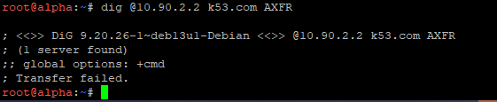
Hasilnya `Transfer failed.`, karena hanya tedd yang diizinkan.

#### Langkah 4 : Buktikan perubahan otomatis tersinkron (notify)

Di prab, naikkan serial menjadi `2026092903` dan reload:
```bash
sed -i 's/2026092902 ; Serial/2026092903 ; Serial/' /etc/bind/k53/k53.com
named-checkzone k53.com /etc/bind/k53/k53.com
rndc reload
```
Tunggu beberapa detik, lalu cek kembali:
```bash
dig @10.90.2.2 k53.com SOA +short
dig @10.90.2.3 k53.com SOA +short
```
Serial di prab dan tedd harus sama-sama `2026092903`.
> Serial terbaru sekarang `2026092903`. Setiap mengubah zona di soal berikutnya, naikkan serial lagi (misalnya `2026092904`) supaya tedd ikut tersinkron.

### Soal 7 : Record vault, core, dan CNAME

Tambahkan di zona `k53.com`:
- `vault.k53.com` → A record ke obladi dan desmond (area vault, web statis)
- `core.k53.com` → A record ke oblada dan molly (area core, web dinamis)
- `www.k53.com` → CNAME ke `penny.k53.com`
- `static.k53.com` → CNAME ke `abbey.k53.com`

Satu nama dengan dua A record membuat DNS mengembalikan dua IP sekaligus (round-robin).

#### Langkah 1 : Update zona di prab (ns1)

Tulis ulang zona dengan serial `2026092904` supaya tedd ikut tersinkron:
```bash
cat > /etc/bind/k53/k53.com << 'EOF'
$TTL 604800
@   IN  SOA prab.k53.com. root.k53.com. (
        2026092904 ; Serial
        604800     ; Refresh
        86400      ; Retry
        2419200    ; Expire
        604800 )   ; Negative Cache TTL

@       IN  NS  prab.k53.com.
@       IN  NS  tedd.k53.com.

; Soal 4
prab    IN  A   10.90.2.2
tedd    IN  A   10.90.2.3
@       IN  A   10.90.3.2

; Soal 5
rootkit IN  A   10.90.2.1
alpha   IN  A   10.90.1.2
beta    IN  A   10.90.1.3
gamma   IN  A   10.90.1.4
delta   IN  A   10.90.5.2
epsilon IN  A   10.90.5.3
abbey   IN  A   10.90.4.2
penny   IN  A   10.90.3.2
obladi  IN  A   10.90.2.4
desmond IN  A   10.90.2.5
oblada  IN  A   10.90.2.6
molly   IN  A   10.90.2.7

; Soal 7
vault   IN  A   10.90.2.4
vault   IN  A   10.90.2.5
core    IN  A   10.90.2.6
core    IN  A   10.90.2.7
www     IN  CNAME   penny.k53.com.
static  IN  CNAME   abbey.k53.com.
EOF
```
Cek sintaks zona, lalu reload:
```bash
named-checkzone k53.com /etc/bind/k53/k53.com
kill -HUP $(pidof named)
```

#### Langkah 2 : Pastikan tedd tersinkron

Cek serial di kedua server, harus sama-sama `2026092904`:
```bash
dig @10.90.2.2 k53.com SOA +short
dig @10.90.2.3 k53.com SOA +short
```
Kalau tedd masih tertinggal, jalankan di tedd:
```bash
pkill named
rm -f /var/cache/bind/k53.com
sleep 1
named
```

#### Langkah 3 : Verifikasi dari dua klien berbeda

Jalankan di alpha, lalu ulangi di delta:
```bash
echo "== vault =="
dig +short vault.k53.com
echo "== core =="
dig +short core.k53.com
echo "== www =="
dig +short www.k53.com
echo "== static =="
dig +short static.k53.com
```
Hasil yang benar (urutan dua IP boleh berbeda):

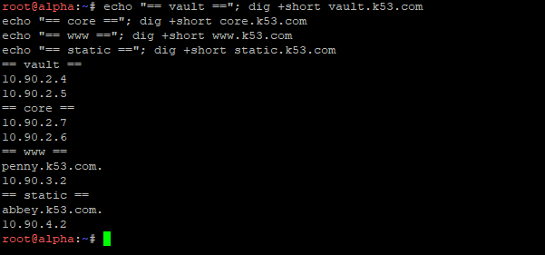
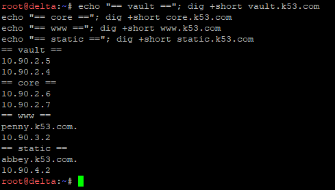

Pastikan tedd juga menjawab dengan benar dan authoritative:
```bash
dig @10.90.2.3 www.k53.com | grep -E "flags|CNAME"
dig @10.90.2.3 vault.k53.com +short
```
Flag harus memuat `aa`, dan `www` harus menampilkan CNAME ke `penny.k53.com.`.

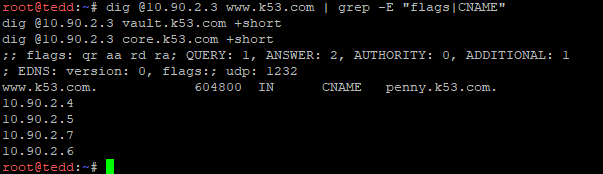

### Soal 8 : Reverse Zone dan PTR Record

Reverse zone dideklarasikan di prab (master) dan ditarik oleh tedd (slave). Hostname yang dibuatkan PTR berada di tiga subnet berbeda (abbey di 10.90.4.x, penny di 10.90.3.x, area vault dan area core di 10.90.2.x), jadi dipakai satu reverse zone `90.10.in-addr.arpa` yang mencakup ketiganya.

| IP         | PTR              |
|------------|------------------|
| 10.90.4.2  | abbey.k53.com.   |
| 10.90.3.2  | penny.k53.com.   |
| 10.90.2.4  | vault.k53.com.   |
| 10.90.2.5  | vault.k53.com.   |
| 10.90.2.6  | core.k53.com.    |
| 10.90.2.7  | core.k53.com.    |

Nama di dalam zona ini ditulis terbalik dari dua oktet terakhir. Contoh: `10.90.3.2` menjadi `2.3`.

#### Langkah 1 : Deklarasi reverse zone di prab (ns1)

Daftarkan zona di `/etc/bind/named.conf.local`. Gunakan `>>` (menambah), jangan `>` karena akan menimpa zona `k53.com`:
```bash
cat >> /etc/bind/named.conf.local << 'EOF'
zone "90.10.in-addr.arpa" {
    type master;
    file "/etc/bind/k53/90.10.in-addr.arpa";
    allow-transfer { 10.90.2.3; };
    notify yes;
};
EOF
```

#### Langkah 2 : Buat file reverse zone di prab

```bash
cat > /etc/bind/k53/90.10.in-addr.arpa << 'EOF'
$TTL 604800
@   IN  SOA prab.k53.com. root.k53.com. (
        2026092901 ; Serial
        604800     ; Refresh
        86400      ; Retry
        2419200    ; Expire
        604800 )   ; Negative Cache TTL

@       IN  NS  prab.k53.com.
@       IN  NS  tedd.k53.com.

2.4     IN  PTR abbey.k53.com.
2.3     IN  PTR penny.k53.com.
4.2     IN  PTR vault.k53.com.
5.2     IN  PTR vault.k53.com.
6.2     IN  PTR core.k53.com.
7.2     IN  PTR core.k53.com.
EOF
```

#### Langkah 3 : Cek dan jalankan ulang named di prab

```bash
cat /etc/bind/named.conf.local
named-checkconf
named-checkzone 90.10.in-addr.arpa /etc/bind/k53/90.10.in-addr.arpa
pkill named
sleep 1
named
dig @127.0.0.1 -x 10.90.3.2 +short
```
`named-checkzone` harus menampilkan `OK`, dan `dig -x` harus mengembalikan `penny.k53.com.`.

#### Langkah 4 : Tarik reverse zone sebagai slave di tedd (ns2)

Daftarkan zona slave di `/etc/bind/named.conf.local` (tetap dengan `>>`):
```bash
cat >> /etc/bind/named.conf.local << 'EOF'
zone "90.10.in-addr.arpa" {
    type slave;
    file "/var/cache/bind/90.10.in-addr.arpa";
    masters { 10.90.2.2; };
};
EOF
```
Cek config, jalankan ulang named, lalu pastikan salinan zona sudah ditarik:
```bash
cat /etc/bind/named.conf.local
named-checkconf
pkill named
sleep 1
named
sleep 3
ls -l /var/cache/bind/
```
File `90.10.in-addr.arpa` harus muncul di samping `k53.com`. Record PTR tidak perlu diisi manual di tedd karena datanya ditarik otomatis dari prab lewat zone transfer.

#### Langkah 5 : Verifikasi query reverse

Jalankan dari salah satu klien (misalnya alpha), ke prab lalu ke tedd:
```bash
for ip in 10.90.4.2 10.90.3.2 10.90.2.4 10.90.2.5 10.90.2.6 10.90.2.7; do
  echo -n "$ip -> "
  dig @10.90.2.2 -x $ip +short | tr '\n' ' '
  echo
done
```
```bash
for ip in 10.90.4.2 10.90.3.2 10.90.2.4 10.90.2.5 10.90.2.6 10.90.2.7; do
  echo -n "$ip -> "
  dig @10.90.2.3 -x $ip +short | tr '\n' ' '
  echo
done
```
Hasil yang benar di keduanya: `abbey.k53.com.`, `penny.k53.com.`, `vault.k53.com.` (dua kali), dan `core.k53.com.` (dua kali).

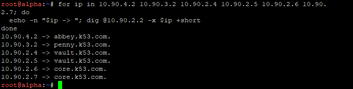

Pastikan jawabannya authoritative dan serial SOA reverse zone sama di kedua server:
```bash
dig @10.90.2.2 -x 10.90.4.2 | grep flags
dig @10.90.2.3 -x 10.90.4.2 | grep flags
dig @10.90.2.2 90.10.in-addr.arpa SOA +short
dig @10.90.2.3 90.10.in-addr.arpa SOA +short
```
Flag harus memuat `aa`, dan serial di kedua server harus sama (`2026092901`).

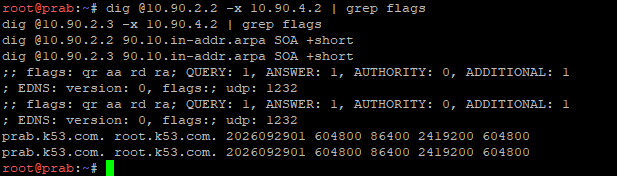
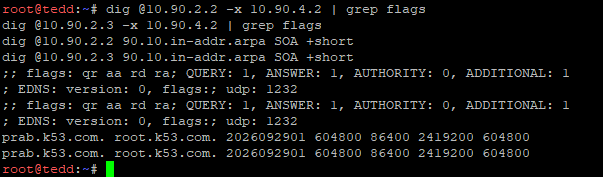

> Serial reverse zone terpisah dari serial zona `k53.com`. Kalau PTR diubah nanti, naikkan serialnya (misalnya `2026092902`), jalankan ulang named di prab, lalu di tedd jalankan `rm -f /var/cache/bind/90.10.in-addr.arpa` sebelum menjalankan ulang named.

### Soal 9 : Web Statis dengan Apache di Area Vault

Layanan web statis dijalankan di node area vault (obladi dan desmond) memakai Apache. Folder `/arsip/` dibuat dengan fitur autoindex (directory listing) aktif, sehingga seluruh daftar file di dalamnya bisa ditelusuri dari browser. Pengujian dilakukan lewat hostname, bukan IP address.

Langkah 1, 3, dan 4 dijalankan di **obladi dan desmond** dengan perintah yang sama. Langkah 2 berbeda di nilai `N`.

#### Langkah 1 : Instal Apache

Jalankan di obladi, lalu ulangi di desmond:
```bash
ping -c 2 google.com
apt-get update
apt-get install apache2 curl -y
```

#### Langkah 2 : Buat folder /arsip/ dan isinya

Folder dibuat di dalam document root Apache supaya URL-nya `/arsip/`. Isi file sengaja memuat nama node, supaya nanti di Soal 11 bisa dibuktikan bahwa Penny membagi trafik ke obladi dan desmond.

obladi:
```bash
N=obladi
mkdir -p /var/www/html/arsip
echo "dokumen rahasia 1 dari $N" > /var/www/html/arsip/dokumen1.txt
echo "dokumen rahasia 2 dari $N" > /var/www/html/arsip/dokumen2.txt
echo "catatan dari $N" > /var/www/html/arsip/catatan.txt
echo "<h1>Web statis $N</h1>" > /var/www/html/index.html
```
desmond:
```bash
N=desmond
mkdir -p /var/www/html/arsip
echo "dokumen rahasia 1 dari $N" > /var/www/html/arsip/dokumen1.txt
echo "dokumen rahasia 2 dari $N" > /var/www/html/arsip/dokumen2.txt
echo "catatan dari $N" > /var/www/html/arsip/catatan.txt
echo "<h1>Web statis $N</h1>" > /var/www/html/index.html
```

#### Langkah 3 : Aktifkan autoindex untuk /arsip/

Pastikan `hostname` di node sudah benar (`obladi` atau `desmond`) sebelum menjalankan ini, karena dipakai untuk `ServerName`:
```bash
hostname
```
Lalu jalankan di obladi dan desmond:
```bash
cat > /etc/apache2/conf-available/arsip.conf << 'EOF'
<Directory /var/www/html/arsip>
    Options +Indexes
    AllowOverride None
    Require all granted
</Directory>
EOF
a2enconf arsip
echo "ServerName $(hostname).k53.com" > /etc/apache2/conf-available/servername.conf
a2enconf servername
```
Modul `autoindex` sudah aktif secara default di Debian. Kalau ragu, cek dengan `a2enmod autoindex`.

#### Langkah 4 : Jalankan Apache

```bash
apache2ctl configtest
service apache2 restart
ps aux | grep apache2
```
`configtest` harus menampilkan `Syntax OK`. Kalau `service` tidak bekerja di container, pakai `apache2ctl start` (atau `apache2ctl -k restart` kalau Apache sudah jalan).

#### Langkah 5 : Tes lokal di node

```bash
curl -s http://localhost/arsip/ | grep -E "Index of|txt"
```
Harus muncul `Index of /arsip` dan ketiga file `.txt`.

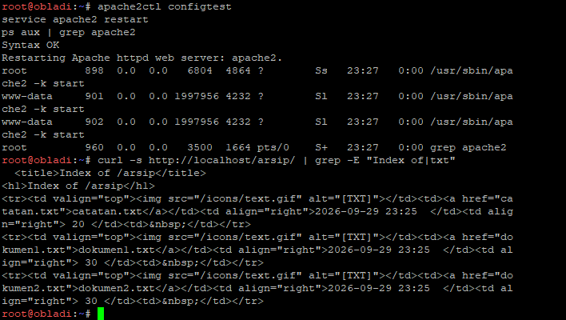

#### Langkah 6 : Verifikasi dari klien lewat hostname

Jalankan di alpha atau delta (instal `curl` dulu dengan `apt-get install curl -y` kalau belum ada):
```bash
curl http://obladi.k53.com/arsip/
curl http://desmond.k53.com/arsip/
curl http://vault.k53.com/arsip/
```
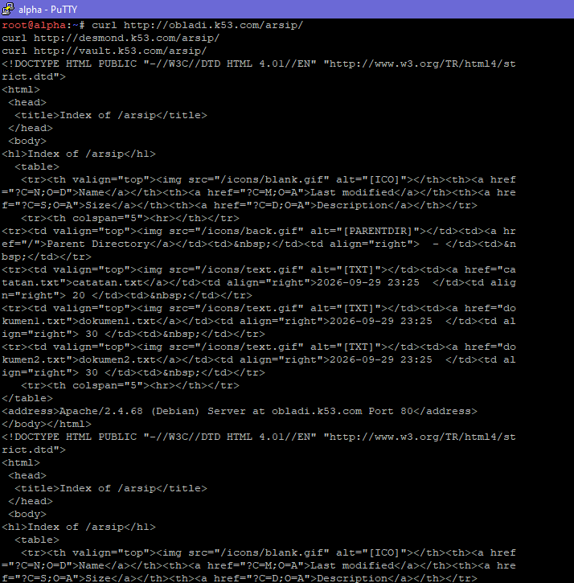
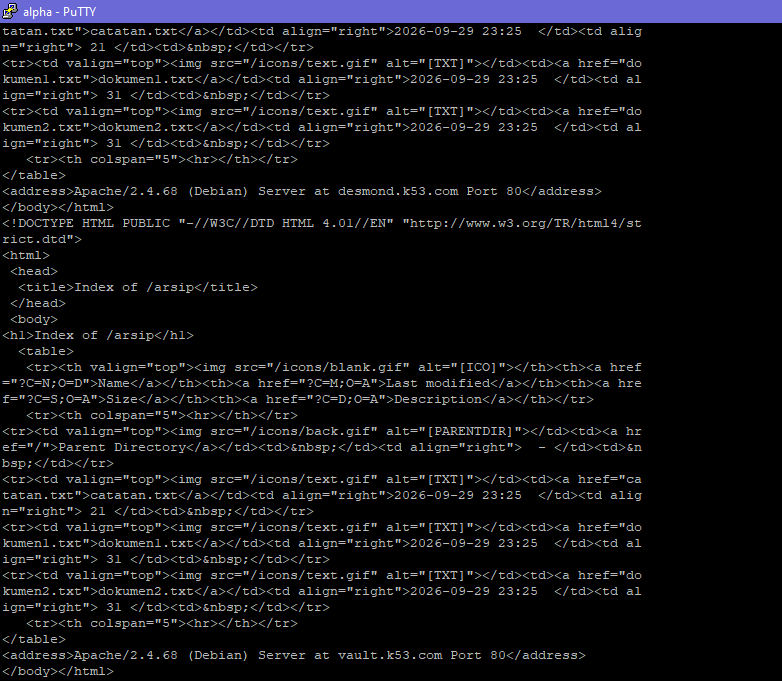
Ketiganya harus menampilkan halaman `Index of /arsip` dengan daftar file. Untuk `vault.k53.com`, DNS mengembalikan dua IP, sehingga jawabannya bisa datang dari obladi atau desmond. Isi salah satu file menunjukkan node yang menjawab:
```bash
curl http://vault.k53.com/arsip/dokumen1.txt
```
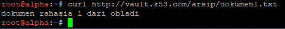
Lewat browser, buka `http://vault.k53.com/arsip/` dan pastikan daftar file bisa ditelusuri.

> Pengujian wajib memakai hostname (`obladi.k53.com`, `desmond.k53.com`, atau `vault.k53.com`), bukan IP address.

### Soal 10 : Web Dinamis dengan Nginx dan PHP-FPM di Area Core

Layanan web dinamis dijalankan di node area core (oblada dan molly) memakai Nginx dan PHP-FPM. Aplikasi sederhana terdiri dari halaman beranda dan halaman profil. Aturan rewrite di Nginx membuat akses `/profil` bekerja dengan URL bersih (tanpa akhiran `.php`). Pengujian dilakukan lewat hostname, bukan IP address.

Semua langkah di bawah dijalankan di **oblada dan molly** dengan perintah yang sama. Halaman PHP menampilkan `gethostname()`, jadi isi file identik di kedua node dan otomatis menunjukkan node mana yang menjawab.

#### Langkah 1 : Instal Nginx dan PHP-FPM

Jalankan di oblada, lalu ulangi di molly:
```bash
ping -c 2 google.com
apt-get update
apt-get install nginx php-fpm curl -y
```
Di Debian 13, paket `php-fpm` membawa PHP 8.4 (sesuai saran soal). Cek versi dan nama socket-nya:
```bash
php -v | head -1
ls /run/php/ /etc/php/
```
Folder `/run/php/` masih kosong sebelum PHP-FPM dijalankan, dan itu normal. Nama socket yang dipakai di Langkah 3 adalah `php8.4-fpm.sock`. Kalau versi PHP berbeda, ganti angkanya di Langkah 3.

#### Langkah 2 : Buat aplikasi sederhana (beranda dan profil)

Beranda:
```bash
mkdir -p /var/www/core
cat > /var/www/core/index.php << 'EOF'
<h1>Beranda Area Core</h1>
<p>Dilayani oleh node: <?php echo gethostname(); ?></p>
<p>IP pengunjung: <?php echo $_SERVER['REMOTE_ADDR']; ?></p>
<p><a href="/profil">Lihat profil</a></p>
EOF
```
Profil:
```bash
cat > /var/www/core/profil.php << 'EOF'
<h1>Halaman Profil</h1>
<p>Kelompok: K-53</p>
<p>Dilayani oleh node: <?php echo gethostname(); ?></p>
<p><a href="/">Kembali ke beranda</a></p>
EOF
chown -R www-data:www-data /var/www/core
```

#### Langkah 3 : Konfigurasi Nginx dengan aturan rewrite

Aturan `rewrite ^/profil$ /profil.php last;` membuat akses `/profil` dilayani oleh `profil.php`:
```bash
cat > /etc/nginx/sites-available/core << 'EOF'
server {
    listen 80 default_server;
    server_name _;
    root /var/www/core;
    index index.php index.html;

    rewrite ^/profil$ /profil.php last;

    location / {
        try_files $uri $uri/ =404;
    }

    location ~ \.php$ {
        include snippets/fastcgi-php.conf;
        fastcgi_pass unix:/run/php/php8.4-fpm.sock;
    }
}
EOF
```
Aktifkan situs ini dan matikan situs bawaan:
```bash
ln -sf /etc/nginx/sites-available/core /etc/nginx/sites-enabled/core
rm -f /etc/nginx/sites-enabled/default
```
`server_name _` dengan `default_server` membuat Nginx menerima request dengan hostname apa pun (`oblada.k53.com`, `molly.k53.com`, atau `core.k53.com`). Ini juga dibutuhkan untuk reverse proxy Abbey di Soal 11.

#### Langkah 4 : Jalankan PHP-FPM dan Nginx

```bash
service php8.4-fpm start
ls /run/php/
nginx -t
service nginx restart
ps aux | grep -E "nginx|php-fpm"
```
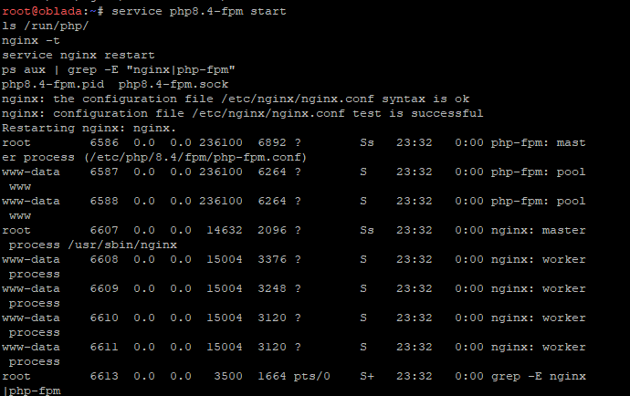
`ls /run/php/` harus menampilkan `php8.4-fpm.sock`, dan `nginx -t` harus menampilkan `syntax is ok` dan `test is successful`. Kalau `service` tidak bekerja di container, pakai `php-fpm8.4` dan `nginx` langsung (jalankan `pkill nginx; nginx` kalau Nginx sudah hidup).

#### Langkah 5 : Tes lokal di node

```bash
curl -s http://localhost/ | head -5
curl -s -o /dev/null -w "%{http_code}\n" http://localhost/profil
curl -s -o /dev/null -w "%{http_code}\n" http://localhost/profil.php
```
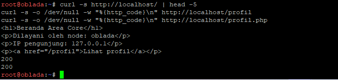
Beranda harus tampil, dan `/profil` harus mengembalikan `200`.

#### Langkah 6 : Verifikasi dari klien lewat hostname

Jalankan di alpha atau delta (instal `curl` dengan `apt-get install curl -y` kalau belum ada):
```bash
curl http://oblada.k53.com/
curl http://molly.k53.com/profil
curl http://core.k53.com/
curl http://core.k53.com/profil
```
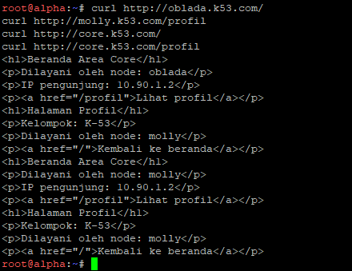
Semua harus tampil, dan `/profil` bekerja tanpa akhiran `.php`. Untuk `core.k53.com`, DNS mengembalikan dua IP, sehingga jawabannya bisa datang dari oblada atau molly (lihat baris "Dilayani oleh node"). Lewat browser, buka `http://core.k53.com/` lalu klik link profil.

> Pengujian wajib memakai hostname (`oblada.k53.com`, `molly.k53.com`, atau `core.k53.com`), bukan IP address.

## 11. Konfigurasi Reverse Proxy (Load Balancer)
Membuat Load Balancer dengan mengonfigurasi Penny menggunakan Apache sebagai reverse proxy menuju node di area *vault* (Obladi & Desmond), dan Abbey menggunakan Nginx sebagai reverse proxy menuju node di area *core* (Oblada & Molly). Tujuannya adalah mendistribusikan lalu lintas jaringan serta meneruskan identitas asli pengunjung menggunakan header `Host` dan `X-Real-IP`.

**Langkah Pengerjaan & Script:**

Di **Penny (Apache)**, install apache, aktifkan modul proxy, lalu buat konfigurasi virtual host:
```bash
apt-get update
apt-get install apache2 -y
a2enmod proxy proxy_http proxy_balancer lbmethod_byrequests headers

cat > /etc/apache2/sites-available/penny-proxy.conf << 'EOF'
<VirtualHost *:80>
ServerName www.k53.com
ProxyPreserveHost On
<Proxy balancer://vaultcluster>
BalancerMember http://10.90.2.4
BalancerMember http://10.90.2.5
ProxySet lbmethod=byrequests
</Proxy>
ProxyPass / balancer://vaultcluster/
ProxyPassReverse / balancer://vaultcluster/
RequestHeader set X-Real-IP "%{REMOTE_ADDR}s"
</VirtualHost>
EOF

a2ensite penny-proxy
a2dissite 000-default
apache2ctl configtest
service apache2 restart
```


Di **Abbey (Nginx)**, install nginx dan atur upstream server:
```bash
apt-get update
apt-get install nginx -y

cat > /etc/nginx/sites-available/abbey-proxy << 'EOF'
upstream core_cluster {
server 10.90.2.6;
server 10.90.2.7;
}
server {
listen 80;
server_name static.k53.com;
location / {
proxy_pass http://core_cluster;
proxy_set_header Host $host;
proxy_set_header X-Real-IP $remote_addr;
}
}
EOF

ln -sf /etc/nginx/sites-available/abbey-proxy /etc/nginx/sites-enabled/abbey-proxy
rm -f /etc/nginx/sites-enabled/default
nginx -t
service nginx restart
```


Tes distribusi di **Alpha** (Klien):
```bash
for i in {1..4}; do curl -s http://static.k53.com/ | grep -i "Dilayani"; done
for i in {1..4}; do curl -s http://www.k53.com/ | grep -i "Web statis"; done
```

---

## 12. Keamanan Autentikasi (Basic Authentication)
Untuk melindungi dokumen rahasia, kita diminta menerapkan *basic authentication* khusus di direktori atau path `/admin` pada node Penny. Pengunjung hanya bisa masuk dengan *username* `prabs` dan *password* `pakar_pinter_jadi_gob***`.

**Langkah Pengerjaan & Script:**

Di **Penny**, buat kredensial `.htpasswd` dan tambahkan aturan keamanan pada konfigurasi proxy sebelumnya:
```bash
apt-get install apache2-utils -y
htpasswd -bc /etc/apache2/.htpasswd prabs pakar_pinter_jadi_gob***

cat > /etc/apache2/sites-available/penny-proxy.conf << 'EOF'
<VirtualHost *:80>
    ServerName www.k53.com
    ProxyPreserveHost On

    <Proxy balancer://vaultcluster>
        BalancerMember http://10.90.2.4
        BalancerMember http://10.90.2.5
        ProxySet lbmethod=byrequests
    </Proxy>

    ProxyPass / balancer://vaultcluster/
    ProxyPassReverse / balancer://vaultcluster/

    RequestHeader set X-Real-IP "%{REMOTE_ADDR}s"

    <Location /admin>
        AuthType Basic
        AuthName "Restricted Area"
        AuthUserFile /etc/apache2/.htpasswd
        Require valid-user
    </Location>
</VirtualHost>
EOF


apache2ctl configtest
service apache2 restart
```


Di **Obladi (10.90.2.4)** & **Desmond (10.90.2.5)**, siapkan halamannya:
```bash
mkdir -p /var/www/html/admin
echo "Ini adalah ruang penyimpanan dokumen rahasia sindikat." > /var/www/html/admin/index.html
```


Uji koneksi dengan *credential* dari **Alpha**:
```bash
curl -u prabs:pakar_pinter_jadi_gob*** -I http://www.k53.com/admin/
curl -u prabs:pakar_pinter_jadi_gob*** http://www.k53.com/admin/
```

---

## 13. URL Redirection
Jika pengguna mengakses melalui IP atau domain *default* (non-kanonik), mereka harus dialihkan (di-redirect). Akses ke Penny dialihkan permanen (301) ke `www.k53.com`, sedangkan Abbey dialihkan sementara (302) ke `static.k53.com`.

**Langkah Pengerjaan & Script:**

Di **Penny (Redirect 301)**:
```bash
cat > /etc/apache2/sites-available/penny-redirect.conf << 'EOF'
<VirtualHost *:80>
ServerName penny.k53.com
ServerAlias 10.90.3.2
Redirect 301 / http://www.k53.com/
</VirtualHost>
EOF

a2ensite penny-redirect.conf
a2dissite 000-default.conf
service apache2 reload
```

Di **Abbey (Redirect 302)**:
```bash
service nginx stop
apt-get update && apt-get install -y apache2
mkdir -p /etc/apache2/sites-available

cat > /etc/apache2/sites-available/abbey-redirect.conf << 'EOF'
<VirtualHost *:80>
ServerName abbey.k53.com
ServerAlias 10.90.4.2
Redirect 302 / http://static.k53.com/
</VirtualHost>
EOF

a2ensite abbey-redirect.conf
a2dissite 000-default.conf
service apache2 restart
```

Uji hasil redirect dari **Alpha**:
```bash
//dipenny (301 Moved Permanently)
curl -I http://penny.k53.com
curl -I http://10.90.3.2

//di abbey (302 Found)
curl -I http://abbey.k53.com
curl -I http://10.90.4.2
```


---

## 14. Real IP Logging

Secara *default*, *log server backend* hanya akan mencatat IP dari server proxy, bukan IP pengguna (klien). Memodifikasi konfigurasi log di server backend agar bisa mengekstrak IP riil dari klien lewat header `X-Forwarded-For`.

**Langkah Pengerjaan & Script:**

Di backend Apache (**Obladi** & **Desmond**):
```bash
sed -i 's/LogFormat "%h/LogFormat "%{X-Forwarded-For}i/g' /etc/apache2/apache2.conf
service apache2 restart
```


Di backend Nginx (**Oblada** & **Molly**):
```bash
cat > /etc/nginx/conf.d/realip.conf << 'EOF'
real_ip_header X-Forwarded-For;
set_real_ip_from 10.90.3.2;
set_real_ip_from 10.90.4.2;
set_real_ip_from 127.0.0.1;
EOF

nginx -t
service nginx restart
sed -i 's/\$remote_addr/\\$remote_addr/g' /etc/nginx/nginx.conf
service nginx reload
```


Tes dengan membuka web dari **Alpha**, lalu cek log dari backend:
```bash
# Di Alpha:
curl http://www.k53.com/arsip/
curl http://core.k53.com/

//Di obladi / desmond: 
tail -n 1 /var/log/apache2/access.log

//Di oblada / molly: 
tail -n 1 /var/log/nginx/access.log

```


---

## 15. Standalone Proxy (Pengecualian Proxy)
Membuat *path* tersendiri di Load Balancer yang dilayani secara mandiri (lokal), bukan di*forward* ke server backend. Di Penny dibuat *path* `/eternal` (berisi file PHP yang bisa dirender), dan di Abbey dibuat *path* `/orion` (berisi HTML statis).

**Langkah Pengerjaan & Script:**

Di **Penny (Apache)**:
```bash
mkdir -p /var/www/eternal
echo '<?php echo "Halo dari PHP Eternal di Penny!"; ?>' > /var/www/eternal/index.php
chown -R www-data:www-data /var/www/eternal
chmod -R 755 /var/www/eternal

apt update && apt install -y libapache2-mod-php
a2enmod php*
service apache2 restart
echo '<?php echo "Halo dari PHP Eternal di Penny!\n"; ?>' > /var/www/eternal/index.php
```
```bash
nano /etc/apache2/sites-available/penny-proxy.conf
```
```bash
<VirtualHost *:80>
    ServerName www.k53.com
    ProxyPreserveHost On

    ProxyPass /eternal !

    Alias /eternal /var/www/eternal
    <Directory /var/www/eternal>
        Options Indexes FollowSymLinks
        AllowOverride All
        Require all granted
    </Directory>
    
    <Location /eternal>
        AddHandler application/x-httpd-php .php
    </Location>

    <Proxy balancer://vaultcluster>
        BalancerMember http://10.90.2.4
        BalancerMember http://10.90.2.5
        ProxySet lbmethod=byrequests
    </Proxy>

    ProxyPass / balancer://vaultcluster/
    ProxyPassReverse / balancer://vaultcluster/

    RequestHeader set X-Real-IP "%{REMOTE_ADDR}s"

    <Location /admin>
        AuthType Basic
        AuthName "Restricted Area"
        AuthUserFile /etc/apache2/.htpasswd
        Require valid-user
    </Location>
</VirtualHost>
```
```bash
apache2ctl configtest
service apache2 restart
```


Di **Abbey (Apache / Nginx fallback)**:
```bash
mkdir -p /var/www/orion
echo "<h1>Halaman Statis Orion di Abbey</h1>" > /var/www/orion/index.html
```
```bash
nano /etc/apache2/sites-available/abbey-redirect.conf
```
```bash
<VirtualHost *:80>
    ServerName abbey.k53.com
    ServerAlias 10.90.4.2

    RewriteEngine On
    # Kecualikan /orion agar tidak ikut ter-redirect ke static.k53.com
    RewriteCond %{REQUEST_URI} !^/orion
    RewriteRule ^/(.*)$ http://static.k53.com/$1 [R=302,L]

    Alias /orion /var/www/orion
    <Directory /var/www/orion>
        Options Indexes FollowSymLinks
        AllowOverride None
        Require all granted
    </Directory>
</VirtualHost>
```
```bash
a2enmod rewrite
apache2ctl configtest
service apache2 restart

```


Cek diclient lain (Alpha)
```bash
curl http://www.k53.com/eternal/index.php

curl http://static.k53.com/orion/index.html
```


---

## 16. Benchmark Server dengan ApacheBench (ab)
Menguji ketahanan dan kecepatan respons *Load Balancer* dengan memberikan 250 permintaan sekaligus secara serentak *(stress test)* dengan utilitas `ab`. 

**Langkah Pengerjaan & Script:**

Di node **Alpha** (Klien):
```bash
apt update && apt install -y apache2-utils
ab -n 250 -c 10 http://www.k53.com/
ab -n 250 -c 10 http://static.k53.com/
```


Hasil analisis:
- Untuk `static.k53.com`:
Complete requests: 250 (Semua berhasil diproses).
Failed requests: 0 (Tidak ada satu pun request yang gagal, server sangat stabil).
Requests per second: 3705.13 (Kecepatan penanganan server sangat tinggi dan ngebut).
- Untuk `[www.k53.com](https://www.k53.com)`:
Complete requests: 250 (Berhasil dieksekusi).
ada Failed requests: 125 (karena ada Length: 125). adanya Failed requests (Length) karena perbedaan respons load balancer

---

## 17. Penambahan TXT Record DNS
Menambahkan catatan informasi teks (TXT Record) untuk domain klien. Jika kita melakukan pencarian jenis TXT ke nama domain Klien (seperti `alpha.k53.com`), hasilnya adalah teks yang dispesifikasikan (contohnya `alpha`).

**Langkah Pengerjaan & Script:**

Di node **Prab (DNS Server)**, edit berkas zone file lokal:
cek dulu filenya ada dimana dan namanya apa
```bash
cat /etc/bind/named.conf.local
```
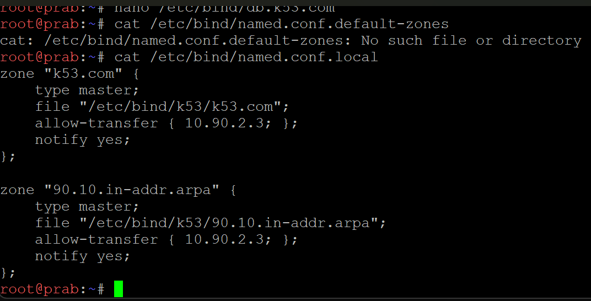
```bash
nano /etc/bind/k53/k53.com
```

tambahkan
```bash
alpha   IN  TXT  "alpha"
beta    IN  TXT  "beta"
gamma   IN  TXT  "gamma"
delta   IN  TXT  "delta"
epsilon IN  TXT  "epsilon"
```
Lalu naikkan nilai Serial pada baris SOA.


```bash
pkill named
named
```

Tes dengan `nslookup` dari klien lainnya (Alpha):
```bash
nslookup -type=TXT alpha.k53.com
```

---

## 18. Modifikasi A Record Sementara (Pengujian Cache DNS / TTL)
Membuktikan konsep pembaruan pada *DNS Cache* klien yang diatur oleh nilai TTL (*Time To Live*). Nilai TTL diset jadi 15 detik, agar perubahan alamat IP sementara bisa segera dirasakan oleh Klien tanpa *cache* terlalu lama.

**Langkah Pengerjaan & Script:**

Di node **Prab (DNS Server)**:
```bash
nano /etc/bind/k53/k53.com

# Ubah record abbey menjadi: abbey 15 IN A 192.168.99.99
# *Naikkan nilai Serial*

pkill named
named
grep abbey /etc/bind/k53/k53.com
```


Pengujian siklus *cache* di **Alpha**:
```bash
nslookup abbey.k53.com
sleep 15
nslookup abbey.k53.com
```

---

## 19. CNAME Record ke Domain Eksternal 
Menghubungkan *(binding)* subdomain internal kita ke alamat domain luar/publik yang ada di internet menggunakan tipe CNAME (Alias), sehingga saat diakses yang muncul adalah konten asli situs eksternal.

**Langkah Pengerjaan & Script:**

Di node **Prab (DNS Server)**:
```bash
nano /etc/bind/k53/k53.com

# Tambahkan CNAME di paling bawah file:
outbound IN CNAME http.badssl.com.
# *Naikkan nilai Serial*

pkill named
named
```


Cek binding dari **Alpha**:
```bash
nslookup outbound.k53.com
curl http://outbound.k53.com
curl -s http://outbound.k53.com | grep -i "<title>"
```


Cek juga dialpha seperti ini:
```bash
curl -I http://outbound.k53.com
curl -s http://outbound.k53.com | grep -i "<title>"
```

---

## 20. Pemulihan Kondisi / Rollback DNS

Memastikan server tidak tertinggal dengan konfigurasi fiktif. Perintah ini untuk mengembalikan alamat IP domain abbey ke konfigurasi aslinya sebelum poin nomor 18.

**Langkah Pengerjaan & Script:**

Di node **Prab (DNS Server)**:
```bash
nano /etc/bind/k53/k53.com

# Ubah IP abbey ke aslinya:
abbey IN A 10.90.4.2
# *Naikkan nilai Serial*

pkill named
named
ps aux | grep named
```


Tes kembali resolusi domain di **Alpha**:
```bash
nslookup abbey.k53.com
```
